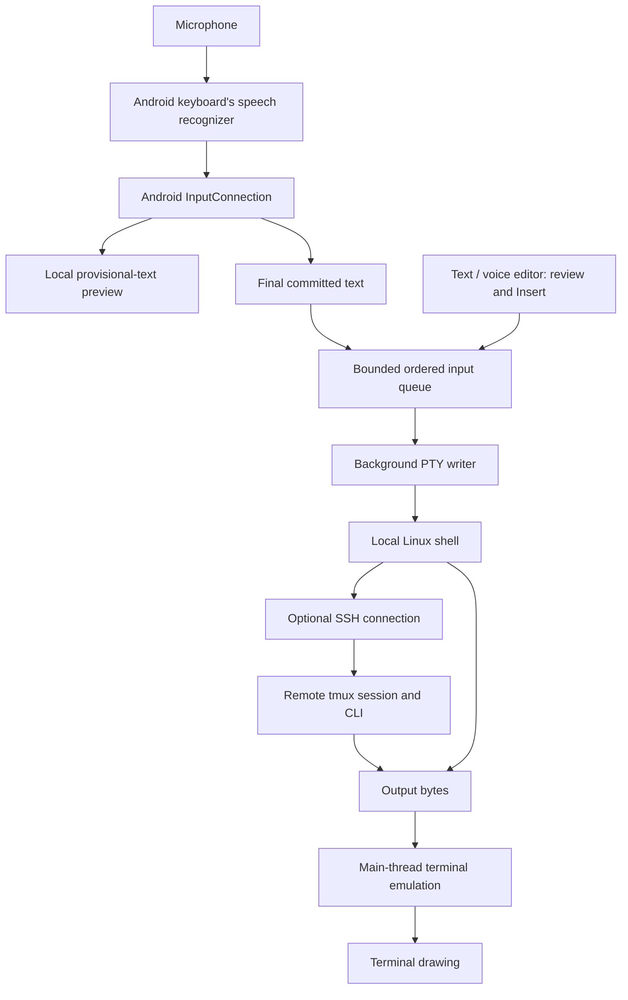

# How Pocket Shell works

Pocket Shell is a native Android terminal application. Kotlin and Jetpack Compose build
the tabs, settings, connection picker and reviewed text editor. A vendored Termux view and
engine render a real pseudo-terminal (PTY). It is not a web terminal and does not stream
the screen through a GHT service.

## Voice and keyboard input

The microphone and speech recognizer belong to the selected Android keyboard. Pocket Shell
does not contain a speech model, request microphone permission, or send microphone audio
to an AI API. A keyboard may recognize speech locally or use its provider's servers.

The keyboard reports provisional phrases with `setComposingText`. These are displayed
locally and can change as recognition improves; they are not sent to a shell. A final
`commitText` or `finishComposingText` sends the final phrase once. A closed/replaced input
connection cannot type into another tab. The preview contains only the current composition,
not previous terminal output.

Normal phrases are converted to UTF-8 in bulk. The special-key path still handles one-shot
Ctrl/Alt/Shift, escape sequences, Enter and Unicode. All engine writes, including paste and
terminal protocol replies, share one bounded FIFO queue. Its existing background writer waits
for the PTY; the Android UI never waits for the subprocess to read. The queue accepts a write
completely or rejects it completely, with at most 1 MiB / 4,096 pending chunks per session.
Accepted means queued, not confirmed executed remotely. Closing a session discards its pending
input. No queued bytes are redirected to another session.

The Text / voice dialog provides a separate editable draft. Insert removes control characters
and converts line breaks/tabs to spaces, preserves bracketed-paste boundaries, and never
presses Enter. A rejected insert retains the draft. Dictation directly into a terminal retains
normal keyboard Enter behavior; use the reviewed editor when you need to inspect a command first.

## Linux, SSH and sessions

- `Bootstrap` downloads a pinned Ubuntu or Alpine root filesystem and verifies its digest.
- Bundled PRoot maps that filesystem into app-private storage without rooting the phone.
  This is a userspace compatibility environment, not a VM or a security boundary against
  code running as the same app UID.
- Each tab has its own PTY and process. Android's foreground service owns them, so rotating
  or recreating the Activity does not recreate a shell.
- SSH runs inside the Linux environment. Authentication uses the user's private key inside
  app storage. Custom hosts are supported; the GHT convenience shortcuts do not grant access.
- Remote tmux sessions survive SSH disconnects on the server. Local PTYs do not survive an
  Android process kill, force-stop or reboot.
- Cold restoration starts fresh shells and shows a clearly marked history excerpt. It does
  not resurrect processes or guarantee a remote SSH connection has resumed.

## Rendering, storage and performance

PTY output enters a bounded incoming queue, then the main thread parses VT/xterm control
sequences and updates the terminal screen. Drawing follows Android's view scheduling. The
current terminal retains up to 20,000 scrollback rows and preserves a history anchor while
new output arrives.

Session snapshots take at most the last 128 rows / 8,000 characters, rather than materializing
all scrollback. Immutable snapshots are written by one background writer using an atomic file.
Save and clear operations are ordered so an old save cannot resurrect deliberately cleared
history. Persistence remains best-effort if Android kills the process before pending IO completes.

Encrypted preferences are initialized once per process. The transcript-enabled setting is
cached, with immediate invalidation when the user changes it. No keystore work occurs on each
redraw. Optional debug logs sample the bounded terminal tail once a second, perform local IO
through one bounded worker, and may skip intermediate screens. They are not audit logs.

## Optional AI copilot

The copilot is independent of dictation. An explicit request sends the user's prompt and
up to 4,000 characters of recent terminal context to the configured Anthropic-compatible
endpoint using the user's own API key. Terminal operation does not require an AI key.
The returned suggestion can be reviewed, inserted or explicitly run. External model availability,
network latency and provider charges are separate from terminal input performance.

Settings saves use encrypted storage without a plaintext fallback. If that storage becomes
temporarily unreadable, a subsequent blank recovery form preserves the entire saved key,
endpoint and model configuration. It must not pair an unread existing key with the form's
default endpoint. Reopen Settings after recovery to review or intentionally replace it.

## Improving the product from here

| Priority | Improvement | Evidence required |
|---|---|---|
| Before promoting this candidate | Real handset dictation with SwiftKey/Gboard, long phrases, corrections, switching tabs, and SSH/tmux under network interruption | Device-specific latency and successful live workflow; emulator IME calls are insufficient |
| Before Play distribution | Target current Android API requirements; test PRoot, foreground services, all-files access and 16-KB native pages | Android 16 / ARM64 runtime tests and Play policy review; changing a version number alone is insufficient |
| Public distribution | Bundle verified corresponding sources/build instructions for all shipped native dependencies, especially PRoot/loaders | Reproducible source-to-binary provenance and a release source archive |
| Everyday battery use | Make wake-lock and screen-on behavior explicit; profile screen-off SSH sessions | Measured power use plus reconnect/task-survival tests |
| Faster first use | Offer a minimal SSH-first setup alongside the full Linux toolchain | Cold-install time, disk use, repair and upgrade tests |
| Faster remote interaction | Evaluate optional Mosh and connection diagnostics | Loss/roaming tests, explicit server requirements, no weakened SSH host verification |
| Speech responsiveness | Test recognizer-specific partial-result cadence; consider an opt-in on-device recognizer only if measurements justify it | Accuracy, language coverage, audio privacy, battery and first-partial latency |
| Maintainability | Refresh the pinned Termux/Compose dependencies through measured upgrades | Upstream tests plus Pocket Shell's IME, PTY, persistence and UI suite |

The current candidate still targets API 34. Google currently requires API 36 for new phone
apps and updates submitted to Play; also validate native dependencies on 16-KB page-size
devices. These are separate migration projects, not a claim that changing targetSdk makes
PRoot compatible. Sources: [Play target requirements](https://developer.android.com/google/play/requirements/target-sdk)
and [native page-size support](https://developer.android.com/guide/practices/page-sizes).

For a broader public audience, make personal SSH hosts the primary setup path and keep GHT
machine shortcuts optional. The app itself has no GHT account/signup requirement; SSH server
authentication and the optional AI provider key are separate. Consider a measured lightweight
SSH-first setup so users who only need remote access need not install the full developer toolkit.

Current performance evidence and release state: [input-performance-20261004.md](input-performance-20261004.md).
